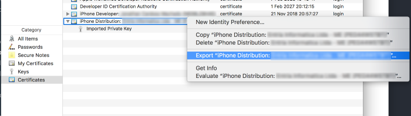
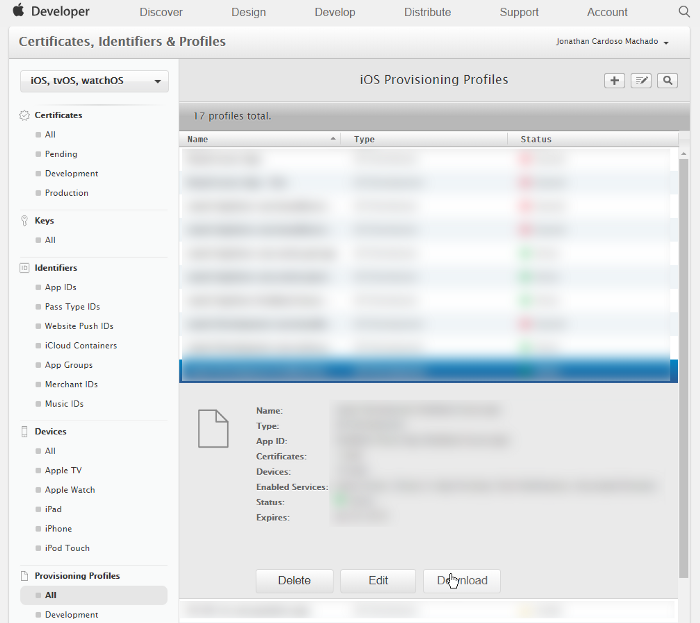

<!-- This was originally posted to: https://medium.com/@jonathancardoso/using-fastlane-match-with-existing-certificates-without-revoking-them-a325be69dac6 -->

Fastlane [match](https://docs.fastlane.tools/actions/match/) improves drastically [code signing](https://codesigning.guide/), even for small teams, their only issue is that by default, it does not work with existing certificates, and that is a show stopper for anyone trying to use it on existing projects. But there is a way to trick fastlane _match_ to use your existing certificates.

> _match_ is the implementation of the https://codesigning.guide concept. _match_ creates all required certificates & provisioning profiles and stores them in a separate git repository. Every team member with access to the repo can use those credentials for code signing. _match_ also automatically repairs broken and expired credentials. It’s the easiest way to share signing credentials across team
> Source: https://docs.fastlane.tools/actions/match/

Let’s get started, first, you need to set up fastlane and fastlane match, to not duplicate the documentation, just follow the setup steps there:

- https://docs.fastlane.tools/getting-started/ios/setup/
- https://docs.fastlane.tools/actions/match/#setup

**Important**: I recommend to take the time to read the whole doc, but on the _match_ guide, only follow the setup step! Do not follow the remaining steps since that would cause fastlane to generate new certificates/provisioning profiles for your app.

Now you have _match_ setup but zero certificates on it, and since it stores them in an encrypted repository, you cannot simply add your existing certificates to it, **it will not work**.

The correct way is to use a hidden feature from the fastlane docs, which allow you to decrypt the _match_ repository and make changes to it.

Before that, make sure you have your certificates and private keys exported somewhere on your machine. To do that, open the Keychain app and get to the `Certificates` category. Select the certificate you are going to use (it must be the one in use by your app), and export it by opening the context menu and choosing “Export: ….”:


Figure: Keychain certificates list

Now do the same for the Imported Private Key, this time select “Personal Information Exchange (.p12)” as File Format, and save. Do not put a passphrase on the exported key, otherwise _match_ will not be able to import it.

The next step is to verify what is the id of that certificate, this information is not easily visible, so we need to grab it using [Spaceship](https://github.com/fastlane/fastlane/tree/master/spaceship), a Ruby library created to be used directly by fastlane. Since you have set up fastlane, you already have access to it.

Start an interactive ruby shell by running `irb` on the terminal.

Type `ruby|>require 'spaceship'` and press enter, this will import the library on the current shell session. Now run the following command to log in on Apple Portal, if fastlane is working correctly, it should use your credentials and log in.

```ruby
Spaceship.login
```

It’s necessary now to grab the list of certificates available on your account, there are 2 ways to do that, using

```ruby
Spaceship.certificate.all
```

Which basically prints all the certificates, or using the more restrictive calls

```ruby
Spaceship.certificate.development.all
```

and

```ruby
Spaceship.certificate.production.all
```

depending on which type of certificate you are trying to use.

The list will contain all properties of every certificate, you need to find the details for the certificate you just saved, look for the name and creation/expiration date. When you find the one you are looking for, rename both key and certificate you saved previously to have that ID as their names.

> **Notice**: fastlane has changed some of the methods we need to use next, so when necessary, I will explicitly be dividing the commands into two sections, one for fastlane versions ≤ 2.105.2, and the other one for the newer version. See https://github.com/fastlane/fastlane/issues/13521 for more details on the change.

## Opening the Encrypted Repository

Run the following commands on the interactive shell to setup some variables we are going to use later:

> Version ≤ 2.105.2

<!-- TODO: Use shell format -->

```
irb(main):001:0> require 'match'
irb(main):002:0> git_url = 'git@github.com:path-to/the-encrypted-certs-repo.git'
 => "git@github.com:path-to/the-encrypted-certs-repo.git" irb(main):003:0> shallow_clone = false
 => false
irb(main):004:0> manual_password = 'password-to-decrypt-the-repo'
 => "password-to-decrypt-the-repo"
```

> Newer Versions

<!-- TODO: Use shell format -->

```
irb(main):001:0> require 'match'
irb(main):002:0> git_url = 'git@github.com:path-to/the-encrypted-certs-repo.git'
=> "git@github.com:path-to/the-encrypted-certs-repo.git"
irb(main):003:0> shallow_clone = false
=> false
irb(main):004:0> ENV["MATCH_PASSWORD"] = 'password-to-decrypt-the-repo'
=> "password-to-decrypt-the-repo"
irb(main):005:0> branch = 'master'
=> "master"
```

Now we will need to clone the repository and decrypt it, we can do that with the following command (note that the result is being assigned to a variable so that we can reuse that later, when it’s time to re-encrypt the repo):

> Version ≤ 2.105.2

<!-- TODO: Use shell format -->

```
irb(main):005:0> workspace = Match::GitHelper.clone(git_url, shallow_clone, manual_password: manual_password)
[21:17:30]: Cloning remote git repo...
[21:17:31]: 🔓  Successfully decrypted certificates repo
=> "/var/folders/5s/5cgmqxkx4fx6bllwgp1y5dlh000gp/T/d2018-0411-3701-148akjh"
```

> Newer Versions

<!-- TODO: Use shell format -->

```
irb(main):006:0> storage = Match::Storage.for_mode('git', { git_url: git_url, shallow_clone: shallow_clone, git_branch: branch, clone_branch_directly: false})
irb(main):007:0> storage.download
irb(main):008:0> encryption = Match::Encryption.for_storage_mode('git', { git_url: git_url, working_directory: storage.working_directory})
irb(main):009:0> encryption.decrypt_files
[21:17:42]: 🔓 Successfully decrypted certificates repo irb(main):010:0> storage.working_directory
=> “/var/folders/ql/4rgq9x7j51n_971xb332w9lc0000gn/T/d20181105–65220–1oalh6v”
```

See how it cloned the repo on the path starting with `/var/folders`, open that folder.

Now depending on your certificate type, you will need to create the respective folder hierarchy.

If it’s a distribution certificate, `certs/distribution`, if a development one, `certs/development`. Place both the `.cer` and `.p12` files inside.

You probably need to do the same for the provisioning profiles, otherwise, _match_ will fail because it cannot find them on the repository, it’s the same procedure, but instead of importing the provisioning profiles from the Keychain, you can download them from Apple Developers Portal:


Figure: Apple Developer portal provisioning profiles

The path where you need to save the provisioning profile depends on the type of the provisioning profile. But basically, it’s one of the following

> profiles/adhoc/AdHoc\_`<appid>`.mobileprovision
> profiles/appstore/AppStore\_`<appid>`.mobileprovision
> profiles/development/Development\_`<appid>`.mobileprovision

after doing that, let’s encrypt the files and commit them to the repo:

> Version ≤ 2.105.2

<!-- TODO: Use shell format -->

```
irb(main):006:0> Match::GitHelper.commit_changes(workspace, "add certificate, private key and provisioning profiles", git_url)
```

> Newer Versions

<!-- TODO: Use shell format -->

```
irb(main):010:0> encryption.encrypt_files
irb(main):011:0> files_to_commit = Dir[File.join(storage.working_directory, "**", "*.{cer,p12,mobileprovision}")]
irb(main):012:0> storage.save_changes!(files_to_commit: files_to_commit)
```

That is it! You should now be able to run fastlane _match_ to grab that certificate and provisioning profiles:

<!-- TODO: Use shell format -->

```
fastlane match distribution --readonly
```

Note the `--readonly`, it’s interesting to always pass this flag so there is no way for _match_ to create new certificates/provisioning profiles if something goes wrong with the previous steps!
