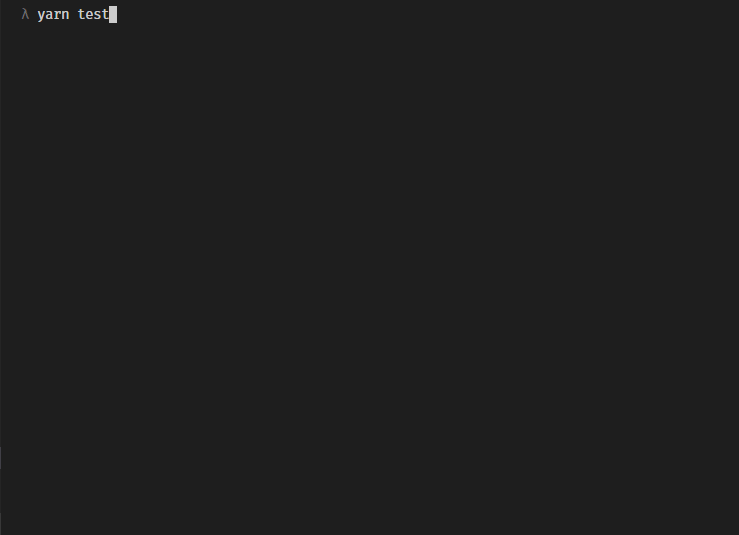
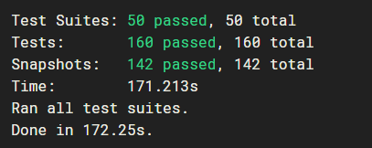
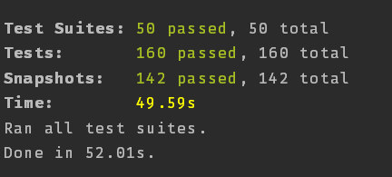

<!-- This was originally posted to: https://itnext.io/parallel-testing-a-graphql-server-with-jest-44e206f3e7d2 -->

This is a follow-up to the awesome post written by Sibelius Seraphini: [Testing a GraphQL server using Jest](https://medium.com/entria/testing-a-graphql-server-using-jest-4e00d0e4980e)

Previously here at [Entria](https://github.com/entria), we were running our tests using the `--runInBand` flag, which makes Jest work serially, running one test after the other.

This was needed because we were creating a physical temporary database to be used by _all_ tests, and as so, we could not let two tests run at the same time, because it would create data inconsistencies between different tests. So the idea was basically to connect to the database before each test, populate the database and run the necessary tests, and after that drop the database, so it could be recreated again by the next test. Repeat this for the number of tests we had.

We solved this thanks to the awesome library mongodb-memory-server by [@nodkz](https://twitter.com/nodkz): https://github.com/nodkz/mongodb-memory-server

To use it, we created our own jest test environment, which is just a single file:

```javascript
// eslint-disable-next-line import/no-extraneous-dependencies
const NodeEnvironment = require('jest-environment-node')
const MongodbMemoryServer = require('mongodb-memory-server')

class MongoDbEnvironment extends NodeEnvironment {
  constructor(config) {
    super(config)
    // eslint-disable-next-line new-cap
    this.mongod = new MongodbMemoryServer.default({
      instance: {
        // settings here
        // dbName is null, so it's random
        // dbName: MONGO_DB_NAME,
      },
      binary: {
        version: '3.6.1',
      },
      // debug: true,
    })
  }

  async setup() {
    await super.setup()
    // console.log('\n# MongoDB Environment Setup #');

    this.global.__MONGO_URI__ = await this.mongod.getConnectionString()
    this.global.__MONGO_DB_NAME__ = await this.mongod.getDbName()
    // this is used to have different names for documents created while testing
    this.global.__COUNTERS__ = {
      user: 0,
    }
  }

  async teardown() {
    // console.log('\n# MongoDB Environment Teardown #');
    await super.teardown()
    await this.mongod.stop()
  }

  runScript(script) {
    return super.runScript(script)
  }
}

module.exports = MongoDbEnvironment
```

And configured jest to use it, by setting the `testEnvironment` setting:

```json
//...
  "jest": {
    "testEnvironment": "<rootDir>/test/environment/mongodb",
    "resetModules": true,
    //...
```

Note the `resetModules` setting there, it’s also important if you use Mongoose, otherwise, it will try to reuse the same connection from the previous test that was run. This happens because we are setting our models using the default connection from mongoose, which is stored directly on the exported mongoose object.

And that is it, you can see it in action on the boilerplate we created here at Entria, here is the PR adding it: https://github.com/entria/graphql-dataloader-boilerplate/pull/80


Figure: before


Figure: after

On one of our biggest projects:


Figure: before


Figure: after
