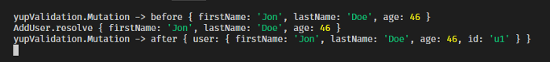
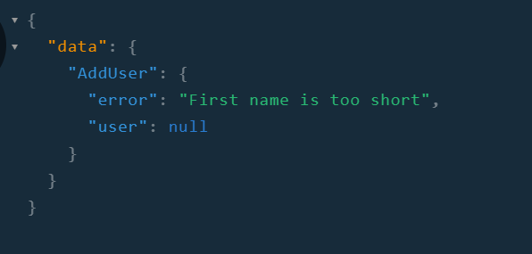

<!-- This was originally posted to: https://itnext.io/graphql-mutation-arguments-validation-with-yup-using-graphql-middleware-645822fb748 -->

Recently, I found out about the awesome library by Prisma called [`graphql-middleware`](https://github.com/prisma/graphql-middleware), which allows running arbitrary code before/after your GraphQL resolvers are called.

In this post, we are going to create a middleware to validate the input arguments of any GraphQL Mutation using Yup.

## Initial Code

For this example, we are going to create a simple `graphql-yoga` server, with the following initial code:

```js
import { GraphQLServer } from 'graphql-yoga'

const typeDefs = `
  type User {
    id: ID!
    firstName: String!
    lastName: String!
    age: String!
  }
  type Query {
    user(id: Int!): User
  }
  type AddUserPayload {
    error: String
    user: User
  }
  type Mutation {
    AddUser(firstName: String!, lastName: String!, age: Int!): AddUserPayload
  }
`

// Users Hash
let currUserId = 0
const users = {}

const resolvers = {
  Query: {
    user: (root, args, context, info) => {
      return users[args.id] || null
    },
  },
  Mutation: {
    AddUser: async (root, args, context, info) => {
      console.log('AddUser.resolve', args)
      const id = `u${++currUserId}`

      // @TODO Add validation
      const user = {
        ...args,
        id,
      }
      users[id] = user

      return {
        user,
      }
    },
  },
}

const server = new GraphQLServer({
  typeDefs,
  resolvers,
})

server.start(() => console.log('Server is running on http://localhost:4000'))
```

## Step 1: Adding the middleware

Let’s name our middleware `yupValidation`:

```js
const yupValidation = {
  async Mutation(resolve, root, args, context, info) {
    console.log('yupValidation.Mutation -> before', args)
    const result = await resolve(root, args, context, info)
    console.log('yupValidation.Mutation -> after', result)
    return result
  },
}
```

According to the docs, the middleware can be an object with the keys matching the types/fields they should be executed on. In our case, we are saying that we want to run our middleware on every mutation.

Adding it to the `GraphQLServer` instance:

```js
const server = new GraphQLServer({
  typeDefs,
  resolvers,
  middlewares: [yupMutationMiddleware()],
})
```

It currently does nothing interesting, we are just calling the mutation resolver and returning it. But see the two `console.log` in there? They can show us something interesting if we submit a mutation to this endpoint right now, let’s do it, send this mutation to the endpoint (you can use the playground that runs automatically at the same port than the server):

```graphql
mutation AddUser {
  AddUser(firstName: "Jon", lastName: "Doe", age: 46) {
    error
    user {
      id
      firstName
      lastName
      age
    }
  }
}
```

The following is going to be logged in the console:



The order is important here, your middleware is executed before the field `resolve` is called, and you can call the `resolve` function anytime inside your middleware function.

## Step 2: Adding the validation schema

Let’s change the way we define our `AddUser` mutation, instead of having the resolve placed directly, let’s use an object. And inside that object, let’s also declare a `validationSchema` property, this is going to tell us how to validate the args of the mutation, and will be a Yup schema:

```js
const resolvers = {
  Query: {
    user: (root, args, context, info) => {
      return users[args.id] || null
    },
  },
  Mutation: {
    AddUser: {
      validationSchema: yup.object().shape({
        firstName: yup.string().trim().required().min(2, 'First name is too short'),
        lastName: yup.string().trim().required().min(2, 'Last name is too short'),
        age: yup
          .number()
          .required()
          .moreThan(18, 'You must be over the age of 18 to register')
          .lessThan(100, 'Are you really that old?'),
      }),
      resolve: async (root, args, context, info) => {
        console.log('AddUser.resolve', args)
        const id = `u${++currUserId}`

        const user = {
          ...args,
          id,
        }
        users[id] = user

        return {
          user,
        }
      },
    },
  },
}
```

Code: Do not forget the import \* as yup from ‘yup’ at the top of the file

## Step 3. Implementing the middleware

Great! We have everything setup, now we just need to make it work. 😅

The basic idea is to determine if the mutation that is being called was defined with a `validationSchema` property and if yes use it to validate the `args`, returning any errors that were found.

> But wait, how am I supposed to get this validationSchema property inside the middleware?!?


We are going to use the notably forgotten, nonetheless important, `info` property. If you never used it or have no idea about what it is, there is an awesome post by Prisma [demystifying the info argument](https://www.prisma.io/blog/graphql-server-basics-demystifying-the-info-argument-in-graphql-resolvers-6f26249f613a/).

The general idea is to use a hidden feature of graphql-js, that if you pass extra properties on the type definition of your GraphQL schema, they are going to be available on the `info` argument of the resolvers.

> ⚠ Notice: As I said above, this relies on something not well documented, which probably may change in future versions of `graphql-js` and/or `graphql-tools`, so use at your own risk. I, personally, think this is pretty safe to use.

The following code will retrieve the mutation field like it was defined and passed to graphql-js:

```js
const mutationField = info.schema.getMutationType().getFields()[info.fieldName]
```

`info.schema.getMutationType()` is self-explanatory, it returns the root type `Mutation`, then we use their `getFields()` method to retrieve all their fields, which is a hash with all the defined mutations, with each mutation name as the key.

`info.fieldName` has the name of the current field resolver, since our middleware is only going to be run against mutations, we can be 100% certain that the `getFields()` called before is going to have a key with that `fieldName`.

Everything now should be pretty straightforward, we just need to verify if there is a `validationSchema` and if yes, validate the `args` against it. If any error is found, we are going to return yup’s validation message as an error field in the result of the mutation call, instead of calling the mutation `resolve`.

> Too much talk, show me the code.

Here it goes:

```js
const yupValidation = {
  async Mutation(resolve, root, args, context, info) {
    const mutationField = info.schema.getMutationType().getFields()[info.fieldName]
    const mutationValidationSchema = mutationField.validationSchema

    if (mutationValidationSchema) {
      try {
        const values = await mutationValidationSchema.validate(args)
      } catch (error) {
        if (error instanceof yup.ValidationError) {
          return {
            error: error.message,
          }
        } else {
          throw error
        }
      }
    }

    return resolve(root, args, context, info)
  },
}
```

Simple, right? And now, if for instance, you call the mutation with a `firstName` that does not match the validation you declared:



Just in case you want something that works out of the box, I’ve created a package with this middleware, but with some improvements and tests, check it out: [JCMais/graphql-yup-middleware](https://github.com/JCMais/graphql-yup-middleware)

---

GraphQL by itself is very powerful, and adding middlewares to the mix gives it even more strength. You can create simple validation middlewares like the one above, to the most complex ones, like for instance authorization/authentication checks, and making your mutations receive objects already fetched from the database as args, instead of just ID’s!

Let me know what you are going to create with this!

Worth checking: [Open Sourcing GraphQL Middleware - A Library to Simplify Your Resolvers](https://www.prisma.io/blog/graphql-middleware-zie3iphithxy/)
