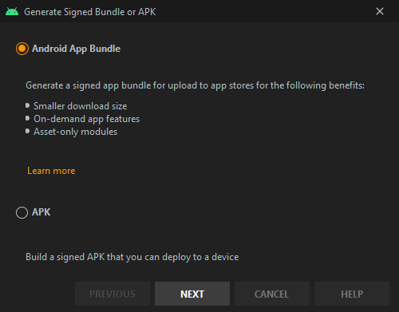

In this article, we will learn how to deploy React Native apps to the Android Play Store using [fastlane](https://fastlane.tools/). This is the first part of a series about automated deployment of React Native apps using fastlane.

Everyone that has been releasing apps manually knows how tiresome and time consuming the process is, the main idea behind this series is to, by the end of it, have full knowledge about how to automate these tasks, letting a CI/CD provider run them. Freeing developers' time and machine processing power.

The first two parts will be focused on the Android Play Store, and then later we will see how to the same for the IOS App Store.

Our main goal is to use specific release tracks on Play Store to give us a fast and reliable environment to test and iterate on our app, be it on the closed alpha track or the open beta track, before sending the release to production and making it available on the Play Store.

Each of the three release tracks we are going to use is going to match one of the branches in our repository:

- Alpha Track → develop Branch
- Beta Track → staging Branch
- Production Track → master branch

> **Note:** while this guide is focused on React Native apps, the same steps can be taken to add fastlane to any Android App.

## Requirements

To follow this guide it's needed to have the following:

- git CLI and basic git knowledge
- [Ruby](https://www.ruby-lang.org/en/) and [Bundler](https://bundler.io/) installed
- [Node.js](https://nodejs.org/en/)
- [Android Studio](https://developer.android.com/studio)
- [Code Editor](https://code.visualstudio.com/)

Ruby basics are nice to have but not required.

## Initializing the Project

The first step we must take is to initialize our React Native project, the React Native docs have a really great [Environment Setup](https://reactnative.dev/docs/environment-setup) section, so follow the instructions there, using the `React Native CLI Quickstart` guide.

Basically, you will need to install the dependencies and run `react-native init`, in our case we are going to name our project `fastlane_react_native_deployment`:

```bash
npx react-native init fastlane_react_native_deployment --version react-native@0.63.1
```


Figure: react-native init output

After the project is created, we must `cd` into the created folder and initialize a local git repository.

```bash
cd fastlane_react_native_deployment && git init
```

Let's commit everything:

```bash
git add --all && git commit -m "initial code"
```

## Creating our Play Store Developer Account

<!-- prettier-ignore -->
Next, we are going to sign up for a developer account on Play Store, this requires a one-time payment of $25 registration fee, in case you have not done so already.

After you have created your account, go to the [play store console dashboard](https://play.google.com/apps/publish) and click `CREATE APPLICATION`:


Figure: Play Store apps listing screen

Choose the language of your app and give it a name:


Figure: We will be using "Fastlane RN Deployment" as the application name

Right now you are not required to fill in the details of your app in the `Store Listing` section, but feel free to do so if you want to.

The other step we need to do in the Play Store Console is to create a service account with API Access to our app, to do so go back to the `All applications` listing, then in the sidebar click on `Settings` → `API Access`, if you have never configured this on your Play Store account, you will see a screen like the following:


Click on `CREATE NEW PROJECT` and a new project on Google Developer Console will be automatically created and linked to your Play Store account.

The screen will be updated with some new information:


In the `Service Accounts` section, click on `CREATE SERVICE ACCOUNT` and a modal will appear, follow the instructions there.

You can give the service account any meaningful name you want, for this tutorial we are going to use `fastlane`. The important steps to take are:


Figure: Add the `Service Account User` role to the service account


Figure: Download the account JSON key file and keep it stored somewhere safe.

After you complete these steps, head back to the Play Store Console page and click `Done`, the page will reload and the newly created service account will appear:


On the service account click `GRANT ACCESS`, a new modal will appear to add it as a user with access to your Play Store account, here you can choose between the `Release Manager` and the `Project Lead` roles.

`Project Lead` has access to all tracks but the `production` one, while the `Release Manager` role has access to everything. We are going to use the `Release Manager` role. Click `ADD USER` to finish the service account setup.

## Creating our Key Store File

> Note: if you are following this for an app that is already published, you probably already have a key store file, so you can skip their creation.

Now we are required to upload manually a version of our app to the Play Store, this is needed for it to identify our app package name. The first time we do that we must also create a signing key for our uploads. The process is detailed thoughtfully here:

[https://developer.android.com/studio/publish/app-signing](https://developer.android.com/studio/publish/app-signing)

To make it easier we are going to use Android Studio. Open Android Studio, then click on `Open an existing Android Studio project` and select the` ./android` folder in our React Native project.


Figure: Android Studio splash screen

Then go to `Build` → `Generate Signed Bundle / APK`:


On the next window select `Android App Bundle` to use the new build format, which is smaller and faster to build than an `apk`, then click `Next`:



And finally, you will be required to create a new key store or to choose an existing one:


Figure: Generate Signed Bundle or APK dialog

As we don't have an existing key store, let's click on `CREATE NEW...` and a new dialog will appear:


Figure: New key store dialog

The `Key store path` should be a location inside the `./android/` folder in our project, for this tutorial we are going to use `android/keystore.jks`. This file is going to be committed to the repository, the file itself is AES-encrypted and the keys can only be obtained if we have both passwords.

> Think on the key store as a Safe which contains multiple smaller boxes, and each of these boxes has their own separated secret. If you want to access the content of a box, which in our case is our upload key, you must know both the safe and box secrets.

The first `Password` field is the password for the key store itself and the second one is for the key with the specified `Alias`, which is going to be our upload key.

Make sure to remember the passwords and the alias you use here, this information will be needed later. We are going to use `app-1` as the key `Alias`.

The fields on the `Certificate` section are the info that will be used to create the key store file, you can fill then with your own/company info.

Click `Ok` after you fill in the info, and it should create the key store file, the previous modal will be filled with the new info. For now, you can close this dialog and Android Studio itself, as we are done creating the key store.

<!-- The `Export encrypted key for enrolling published apps in Google Play App signing` option is not needed, so you can uncheck it. This Key store is going to be our upload key. Google will use the upload key of the first app bundle uploaded to make sure that all subsequent uploads are coming from a trusted source. Keep it safe! -->
<!-- For more details read: [https://support.google.com/googleplay/android-developer/answer/7384423](https://support.google.com/googleplay/android-developer/answer/7384423) -->
<!-- HINT: The keystore.jks is already created now -->
<!-- > If you are doing this in an existing project and it has native dependencies, this step may fail. If this happens you can close this dialog as the key file was already created, and you should be able to build the bundle manually, however, you should only do that after you make the changes shown in the next section. When you have done them, go to the react native project root folder, run `yarn jetify` (this will fix incompatible AndroidX native dependencies), and then run `cd android && ./gradlew bundleRelease`. -->

## Using our Key Store File

Now we need to configure our project to use the signing key when building, first, let's create the .properties file to store our credentials, create the file `android/keystore.properties` with the following contents:

```properties
storePassword=::store_password::
keyPassword=::key_password::
keyAlias=app-1
storeFile=keystore.jks
```

`storePassword` is the password you used for the key store.

`keyPassword` is the password you used for the key itself.

`keyAlias` is the name of the key which in our case was `app-1`.

`storeFile` will point to the location of our key store file, per previous steps, it's called `keystore.jks` and is located inside the `android/` folder, alongside the `keystore.properties` file.

As we said previously, this file should not be committed to the repository, since it contains sensitive information. So make sure to also include it into your `.gitignore` file.

The plan now is to load that file inside our build, or if there are some environment variables with the values we need (hint: when running on CI), use them instead.

Let's do that, open `android/app/build.gradle` and add the following highlighted code above the `android {` block:

```java
def enableHermes = project.ext.react.get("enableHermes", false);

// highlight-start
def areUploadKeystoreEnvsSet = System.getenv("MYRNAPP_RELEASE_STORE_FILE") != null &&
                                System.getenv("MYRNAPP_RELEASE_STORE_PASSWORD") != null &&
                                System.getenv("MYRNAPP_RELEASE_KEY_ALIAS") != null &&
                                System.getenv("MYAPPP_RELEASE_KEY_PASSWORD") != null

def keystorePropertiesFile = rootProject.file("keystore.properties")
def keystorePropertiesFileExists = keystorePropertiesFile.exists()
def keystoreProperties = new Properties()
if (!(keystorePropertiesFileExists || areUploadKeystoreEnvsSet)) {
    throw new InvalidUserDataException('''\
You must have a keystore.properties file in the <rn-root-folder>/android/ folder or set the environments variables:
  MYRNAPP_RELEASE_STORE_FILE
  MYRNAPP_RELEASE_STORE_PASSWORD
  MYRNAPP_RELEASE_KEY_ALIAS
  MYRNAPP_RELEASE_KEY_PASSWORD
''')
}

keystorePropertiesFileExists && keystoreProperties.load(new FileInputStream(keystorePropertiesFile))
// highlight-end

android {
```

This will load our properties file inside the `keystoreProperties` variable. If the `android/keystore.properties` file does not exists and the environment variables are not set, an error will be thrown.

Inside the same file, `android/app/build.gradle`, look for the `signingConfigs` block. It should be around line 165 and look like this:

```java
    signingConfigs {
        debug {
            storeFile file('debug.keystore')
            storePassword 'android'
            keyAlias 'androiddebugkey'
            keyPassword 'android'
        }
    }
```

Right now it only has a config for the `debug` version, we need to add a new block there for the `release` version, which is the one submitted to the store.

Add the following inside the `signingConfigs` block, right below the `debug` block:

```java
        release {
            if (areUploadKeystoreEnvsSet) {
                storeFile rootProject.file(String.valueOf(System.getenv("MYRNAPP_RELEASE_STORE_FILE")))
                storePassword String.valueOf(System.getenv("MYRNAPP_RELEASE_STORE_PASSWORD"))
                keyAlias String.valueOf(System.getenv("MYRNAPP_RELEASE_KEY_ALIAS"))
                keyPassword String.valueOf(System.getenv("MYRNAPP_RELEASE_KEY_PASSWORD"))
            } else {
                storeFile rootProject.file(keystoreProperties['storeFile'])
                storePassword keystoreProperties['storePassword']
                keyAlias keystoreProperties['keyAlias']
                keyPassword keystoreProperties['keyPassword']
            }
        }
```

This will check if the environment variables were set, if they were, it will try to load the settings using their values, if they were not (the else clause) it will load the values from the properties file.

With the release's signing config created we need to use it. In the same file search for the release build type, it should be right below the `signingConfig` block, inside a `buildTypes` block. It looks like this:

```java
        // ...
        release {
            // Caution! In production, you need to generate your own keystore file.
            // see https://reactnative.dev/docs/signed-apk-android.
            signingConfig signingConfigs.debug
            minifyEnabled enableProguardInReleaseBuilds
            proguardFiles getDefaultProguardFile("proguard-android.txt"), "proguard-rules.pro"
        }
        // ...
```

We need to change the `signingConfig` field in the `release` block to use `signingConfigs.release` instead of the debug one:

```java
            // ...
            signingConfig signingConfigs.release
            // ...
```

The next step is to generate our AAB ([Android App Bundle](https://developer.android.com/guide/app-bundle)) binary. This is as easy as running the following commands:

```bash
cd android
./gradlew bundleRelease
```

After the command execution the built `app-release.aab` file will be available at `android/app/release/app-release.aab`.

This file should not be committed to the repository, so add the following to `.gitignore`:

```gitignore
android/app/*/*.aab
```

Let's commit everything we have done so far:

```bash
git add --all && git commit -m "android release signing"
```

## Uploading our First App Bundle to Play Store

Now it's time to create the Alpha closed track in the Play Store Console. Go back to the Play Store Console applications listing and click on `App releases` in the sidebar.


Scroll down to `Closed track`, and click `MANAGE` on the `Alpha` track, in the next screen click `CREATE RELEASE`.


Click `CONTINUE` to let Google manage and protect the app signing key. Then in the next section, we will need to upload the `app-release.aab` file we just built.


After the upload is done processing, verify if the `Release name` is correct, add a changelog entry if needed, and click `Save`.

You are probably going to see a warning that will not let you start the roll-out of the alpha release, related to the fact that there are no internal testers on the Alpha track. You can take this opportunity to include the testers, go back to the `App releases` page and click on `MANAGE` in the Alpha track.


Open the `Manage testers` section and include any e-mails you need. After this is complete, press `EDIT RELEASE`.

Everything should be filled with the same data than before, press `REVIEW`, and the `START ROLLOUT TO ALPHA` button should be available, click on it to finish the first alpha release.

If you are doing this for a new app, the only important task remaining is to make sure the following checkmarks are green, if the app is already available in the Play Store, this step is not necessary as it was done the first time the app was uploaded.


Figure: Click on each section and follow the instructions.

We are finally done with the Play Store Console.

## Initializing Fastlane

Now we are going to set up [fastlane](https://fastlane.tools/), the tool we will use to do the heavy lifting for us when deploying to the play store.

The first step is to initialize the Ruby [bundler](https://bundler.io/) on our android folder and to add fastlane as a dependency:

```bash
cd ./android
bundle init
bundle install --path vendor/bundle
bundle add fastlane
```

> Note: If for some reason the last command results in an error, it's probably because you don't have development tools installed on your OS. For `macOS` this means running `xcode-select --install`. On Windows the Ruby installer will take care of installing the required packages. And on most \*nix variants it's needed to install the `-dev` variant of the ruby package.

Add `android/vendor` and `android/.bundle` to your `.gitignore`, as we don't want to commit this folder to the repository.

Then run:

```bash
bundle exec fastlane init
```


Figure: fastlane init output

You will be asked for some information related to your app. The first information is the package name, this is the app identifier you are using. For Android, this means the value of the field `android.defaultConfig.applicationId` in the `android/app/build.gradle` file.

The second information is the path to the service account JSON we saved previously.

Finally, the third question will ask us if we want to download the existing metadata from the Play Store and setup metadata management, we will answer `y` here.

After this step, there will be a new folder called `fastlane` inside the `android` folder, open this folder and you will find the fastlane files. The most important one here is the `Fastfile`, which contains our lanes: some common tasks we can run from the CLI.

## Android Versioning

One of the main aspects of having an automated deployment process for mobile applications is to automatically increment their build numbers for each subsequent build. This is, in fact, a requirement to upload new bundles to the Play Store: you cannot upload a new version that has the same, or smaller, build number than the latest one uploaded. If we try to do so an error will be thrown:

> **[!] Google Api Error:** apkNotificationMessageKeyUpgradeVersionConflict: APK specifies a version code that has already been used. - APK specifies a version code that has already been used.

Currently, fastlane does not provide an action to increment the Android version as it does for IOS, fortunately, there are other ways to do that, and one of them is using a fastlane plugin. One was specifically written for this tutorial: [android_version_manager](https://github.com/JCMais/fastlane-plugin-android_version_manager)

<!-- TODO: make above repo public -->

Let's add that plugin to our project, go to the `android/fastlane` folder inside the react native project:

```bash
cd android/fastlane
```

And then run:

```bash
bundle exec fastlane add_plugin android_version_manager
```

Fastlane will ask `Should fastlane modify the Gemfile at path '<some-path-to>/android/Gemfile' for you?`

Answer yes.

Now we can use the plugin to handle versioning for us. Open `android/fastlane/Fastfile` in your favorite text editor.

```ruby
# This file contains the fastlane.tools configuration
# You can find the documentation at https://docs.fastlane.tools
#
# For a list of all available actions, check out
#
#     https://docs.fastlane.tools/actions
#
# For a list of all available plugins, check out
#
#     https://docs.fastlane.tools/plugins/available-plugins
#

# Uncomment the line if you want fastlane to automatically update itself
# update_fastlane

default_platform(:android)

platform :android do
  desc "Runs all the tests"
  lane :test do
    gradle(task: "test")
  end

  desc "Submit a new Beta Build to Crashlytics Beta"
  lane :beta do
    gradle(task: "clean assembleRelease")
    crashlytics

    # sh "your_script.sh"
    # You can also use other beta testing services here
  end

  desc "Deploy a new version to the Google Play"
  lane :deploy do
    gradle(task: "clean assembleRelease")
    upload_to_play_store
  end
end
```

The `Fastfile` is essentially a Ruby file, with some extra DSL mixed in. It contains multiple lanes, which are steps we can run to help us automate multiple tasks.

For now, don't pay to much attention to the existing lanes, just note that at the root we have a platform block called `:android` with individual lanes inside.

We are going to create two new lanes inside this block.

### Build Number

The first lane we will create is called `ibn`. This lane will be responsible for **i**ncrementing the **b**uild **n**umber.

The Android `builder number` we are referring to here is commonly known as `internal version number`, and is the value of the `versionCode` field in the file `android/app/build.gradle`.

Here is how our `ibn` lane looks like:

```ruby
desc "Increment build number and push to repository - Build number in this case is the android version code"
lane :ibn do |options|
  should_commit = options.fetch(:should_commit, true)
  commit_message = options.fetch(:commit_message, "android: bump build number (version code) [skip ci]")
  should_push = options.fetch(:should_push, true)

  ensure_git_status_clean if should_commit

  params = {
    :app_project_dir => 'app'
  }
  if options[:build_number]
    params[:version_code] = options[:build_number].to_i
  end

  android_increment_version_code(params)
  new_version_code = Actions.lane_context[Actions::SharedValues::ANDROID_VERSION_CODE]
  UI.important("Incremented android version code to #{new_version_code}")

  if should_commit
    path = "android/app/build.gradle"
    git_add(path: path)
    git_commit(path: path, message: commit_message)
    # Push the new commit and tag back to your git remote
    push_to_git_remote if should_push
  end
end
```

Here is an overview of what we just did.

First, we have the `ruby|>lane :name do |options| ... end` block, which creates the lane itself. We can have some description of the lane by using the `ruby|>desc` call above the lane definition.

The first few lines of our lane are creating three local variables. We will use them to store the values of some options passed when calling our lane.

For example, the following code:

```ruby
  # ...
  should_commit = options.fetch(:should_commit, true)
  # ...
```

Is going to store in the variable named `ruby|>should_commit` the value passed on the CLI for the `ruby|>should_commit` option, in case no value was passed, we are going to assume `ruby|>true` as the default value (the second argument passed to `ruby|>fetch`).

Next, we are making sure that when we run our lane, there are no non-committed changes to our git repository:

```ruby
  ensure_git_status_clean if should_commit
```

This step is necessary in case we are going to automatically commit the build number bump to our repository (`ruby|>should_commit` is `ruby|>true`), as we don't want to commit unrelated files.

Right after that we are creating another local variable called `ruby|>params`, which is initialized to a hash with a single key, `ruby|>:app_project_dir`:

```ruby
  params = {
    :app_project_dir => 'app'
  }
```

This variable is going to be used later when we call the plugin method to increment the build number, it's needed because we want to pass an extra param to this method depending on if we called our lane with a certain option or not:

```ruby
  if options[:build_number]
    params[:version_code] = options[:build_number].to_i
  end
```

If we passed the option `build_number` when calling our lane from the command-line, their value is going to be added as a new item to our `ruby|>params` hash, with the key `ruby|>:version_code`. The only difference being that we cast it to integer first by calling `to_i`.

We can now call the action from the `android_version_manager` plugin, passing the `params` hash as the sole argument. This action, as their name implies, is responsible for incrementing the version code in the `android/app/build.gradle` file.

```ruby
  android_increment_version_code(params)
```

The source code for this action can be found on GitHub: [./lib/fastlane/plugin/android_version_manager/actions/android_increment_version_code_action.rb](https://github.com/JCMais/fastlane-plugin-android_version_manager/blob/master/lib/fastlane/plugin/android_version_manager/actions/android_increment_version_code_action.rb)

After calling the action, we are able to retrieve the new version code and display it on the terminal:

```ruby
  new_version_code = Actions.lane_context[Actions::SharedValues::ANDROID_VERSION_CODE]
  UI.important("Incremented android version code to #{new_version_code}")
```

`Actions.lane_context` is a special hash used by fastlane that contains values shared from actions that were run previously, in our case we are retrieving the value for the key `Actions::SharedValues::ANDROID_VERSION_CODE`.

This is the field that the `android_increment_version_code` action uses to store the new version code. How do we know that?

By looking at the documentation of the action:

```ruby
bundle exec fastlane action android_increment_version_code
```

Which is going to print something like this:


Figure: android_increment_version_code documentation

The keys we can use are available on the `android_increment_version_code Output Variables` table.

The same output also shows a description of the action and each option it accepts.

Remember that the `params` hash we are passing has a `:app_project_dir` key and could also contain another key `:version_code`? As we can see above, these are options accepted by the action.

Finally, at the end of our lane, we have:

```ruby
  if should_commit
    path = "android/app/build.gradle"
    git_add(path: path)
    git_commit(path: path, message: commit_message)
    # Push the new commit and tag back to your git remote
    push_to_git_remote if should_push
  end
```

If `ruby|>should_commit` is `ruby|>true`, which it's going to be by default (remember the `ruby|>options.fetch` a few lines above), we are going to add, and commit, the `android/app/build.gradle` file to our repository, and if `should_push` is also true, we are going to push these changes to the remote git repository immediately after.

The commit message is going to be the value of the `commit_message` variable, which comes from the `commit_message` command-line argument we pass to our lane.

Now let's call our lane, first make sure you are in the android directory of the React Native project:

```ruby
cd android
```

Then run:

```ruby
bundle exec fastlane android ibn should_commit:false
```

> Note how arguments are passed to the lane using the `[key]:[value]` format.

The output should look similar to this:


From the command output above we can see that version code (build number) was incremented from `1` to `2`. Which means our lane worked. 🎉

### Version Number

The second lane we need is called `ivn`. This lane will be responsible for **i**ncrementing the **v**ersion **n**umber.

The Android `version number` we are referring to here is commonly known as `version name`, and is the value of the `versionName` field in the file `android/app/build.gradle`. This is the value visible for users when downloading the app.

We are going to use a Semver like versioning, `major.minor.patch`.

Here is how our `ivn` lane looks like:

```ruby
desc "Increment version number and push to repository - Version number in this case is the android version name"
lane :ivn do |options|
  should_commit = options.fetch(:should_commit, true)
  commit_message = options.fetch(:commit_message, "android: bump version number (version name) [skip ci]")
  should_push = options.fetch(:should_push, true)

  # Ensure that your git status is not dirty
  ensure_git_status_clean if should_commit

  increment_type = options.fetch(:increment_type, "patch")
  new_version_params = options[:version]

  params = {
    app_project_dir: 'app',
    increment_type: increment_type,
  }

  unless new_version_params.nil?()
    params[:version_name] = new_version_params
  end

  android_increment_version_name(params)
  new_version_name = Actions.lane_context[Actions::SharedValues::ANDROID_VERSION_NAME]
  UI.important("Incremented android version name to #{new_version_name}")

  if should_commit
    path = "android/app/build.gradle"
    git_add(path: path)
    git_commit(path: path, message: commit_message)
    # Push the new commit and tag back to your git remote
    push_to_git_remote if should_push
  end
end
```

This lane follows the same idea as the previous one. But it accepts a few more options. The most important ones being `increment_type` and `version`.

We can pass either of them. `version` allows us to specify the new version number directly, while `increment_type` gives us the option to just say the increment type, which can be one of: `patch`, `minor`, and `major`.

```ruby
  increment_type = options.fetch(:increment_type, "patch")
  new_version_params = options[:version]
```

If we don't pass anything, the default will be a `patch` increment of the current version.

After we handle the lane options, we call the `android_increment_version_name` action, provided by the `android_version_manager` plugin we have been using.

```ruby
  android_increment_version_name(params)
  new_version_name = Actions.lane_context[Actions::SharedValues::ANDROID_VERSION_NAME]
  UI.important("Incremented android version name to #{new_version_name}")
```

The source code for this action can also be found on GitHub: [./lib/fastlane/plugin/android_version_manager/actions/android_increment_version_name_action.rb](https://github.com/JCMais/fastlane-plugin-android_version_manager/blob/master/lib/fastlane/plugin/android_version_manager/actions/android_increment_version_name_action.rb)

And then the same git handling we did in the previous lane is also being done here.

```ruby
  if should_commit
    path = "android/app/build.gradle"
    git_add(path: path)
    git_commit(path: path, message: commit_message)
    # Push the new commit and tag back to your git remote
    push_to_git_remote if should_push
  end
```

Now let's call our lane, again make sure you are in the android directory of the React Native project:

```ruby
cd android
```

Then run:

```ruby
bundle exec fastlane android ivn should_commit:false
```

The output should look similar to this:


The version was correctly bumped from `1` to `1.0.1`. 🎉

## Sending Alpha Version to the Play Store using Fastlane

Now that we have the lanes responsible for bumping the build and version numbers, it's time to create our lane responsible for uploading a new alpha version to the Play Store.

Here is our `alpha` lane:

```ruby
desc "Build and push a new alpha build to the Play Store"
lane :alpha do
  build_params = {
    build_task: "bundle",
  }
  build(build_params)

  supply_params = {
    track: "alpha",
    # defaults to completed
    release_status: "draft",
  }
  supply(supply_params)
end
```

The code for this lane is much simpler than the ones we have written so far.

Right at the start we are changing to another lane, called `build`, and passing some options to it.

We can call other lanes directly, they are just functions.

The `build` lane is responsible for building our AAB file:

```ruby
desc "Build a version of the app"
lane :build do |options|
  build_task = options.fetch(:build_task, "assemble")
  build_type = options.fetch(:build_type, "Release")

  gradle_params = {
    task: build_task,
    build_type: build_type,
  }
  gradle(gradle_params)
end
```

It accepts two options:

- `build_task`: which can be either `assemble` or `bundle`
- `build_type`: the variant we are building

And then passes those to the [`gradle`](https://docs.fastlane.tools/actions/gradle/) action.

After the `build` lane finishes, the execution context goes back to our `alpha` lane:

```ruby
  supply_params = {
    track: "alpha",
    # defaults to completed
    release_status: "draft",
  }
  supply(supply_params)
```

We then call the [`supply`](https://docs.fastlane.tools/actions/supply/) action passing two option:

- `track` with the value `alpha`
- `release_status` with the value `draft`
  This is needed as we are not releasing directly to the Play Store - But to one of our closed tracks.

Let's run our lane and see what happens:

```bash
bundle exec fastlane android alpha
```


From the above output, we can see that fastlane calls into our `build` lane and after that goes back to the `alpha` lane, which then calls the `supply` action.

After fastlane uploads the new alpha release it should output something similar to this:


> Note: If you receive an error like this:
>
> > Google Api Error: badRequest: Only releases with status draft may be created on draft app. - Only releases with status draft may be created on draft app.
>
> It means you have not released the initial alpha version directly in the Play Store Console, like mentioned in the previous steps.

If you go to the Play Store Console `App releases` screen, you should see that the latest version is the one we uploaded:


Awesome! Time to work on our `beta` and `production` lanes.

## Creating Lanes for the Beta and Production Tracks

The `beta` and `production` lanes are even simpler. As we are always going to release first to `alpha`, the only thing we need to do is to promote from one track to the other.

`Alpha → Beta → Production`

```ruby
desc "promote the current alpha build to the beta track"
lane :beta do
  version_codes = google_play_track_version_codes(track: "alpha")

  version_code = version_codes.first

  supply_params = {
    track: "alpha",
    track_promote_to: "beta",
    version_code: version_code,
  }
  supply(supply_params)
end

desc "promote the current beta build to the production track"
lane :production do
  version_codes = google_play_track_version_codes(track: "beta")

  version_code = version_codes.first

  supply_params = {
    track: "beta",
    track_promote_to: "production",
    version_code: version_code,
  }
  supply(supply_params)
end
```

We are using the action `google_play_track_version_codes` to retrieve the active version codes of the current track we are promoting from.

We then use the first version code found as the one to be promoted to the next track. This is needed to use the same changelog from the specified version code.

Before we run our new lanes, we must remove the default `beta` lane that fastlane created initially. It should be right at the top:

```ruby
  desc "Submit a new Beta Build to Crashlytics Beta"
  lane :beta do
    gradle(task: "clean assembleRelease")
    crashlytics

    # sh "your_script.sh"
    # You can also use other beta testing services here
  end
```

In fact, we can remove all lanes we are not using. The final `Fastfile` looks like this:

```ruby
default_platform(:android)

platform :android do
  desc "Build a version of the app"
  lane :build do |options|
    build_task = options.fetch(:build_task, "assemble")
    build_type = options.fetch(:build_type, "Release")

    gradle_params = {
      task: build_task,
      build_type: build_type,
    }
    gradle(gradle_params)
  end

  desc "Build and push a new alpha build to the Play Store"
  lane :alpha do
    build_params = {
      build_task: "bundle",
    }
    build(build_params)

    supply_params = {
      track: "alpha",
    }
    supply(supply_params)
  end

  desc "promote the current alpha build to the beta track"
  lane :beta do
    version_codes = google_play_track_version_codes(track: "alpha")

    version_code = version_codes.first

    supply_params = {
      track: "alpha",
      track_promote_to: "beta",
      version_code: version_code,
    }
    supply(supply_params)
  end

  desc "promote the current beta build to the production track"
  lane :production do
    version_codes = google_play_track_version_codes(track: "beta")

    version_code = version_codes.first

    supply_params = {
      track: "beta",
      track_promote_to: "production",
      version_code: version_code,
    }
    supply(supply_params)
  end

  desc "Increment build number and push to repository - Build number in this case is the android version code"
  lane :ibn do |options|
    should_commit = options.fetch(:should_commit, true)
    commit_message = options.fetch(:commit_message, "android: bump build number (version code) [skip ci]")
    should_push = options.fetch(:should_push, true)

    ensure_git_status_clean if should_commit

    params = {
      :app_project_dir => 'app'
    }
    if options[:build_number]
      params[:version_code] = options[:build_number].to_i
    end

    android_increment_version_code(params)
    new_version_code = Actions.lane_context[Actions::SharedValues::ANDROID_VERSION_CODE]
    UI.important("Incremented android version code to #{new_version_code}")

    if should_commit
      path = "android/app/build.gradle"
      git_add(path: path)
      git_commit(path: path, message: commit_message)
      # Push the new commit and tag back to your git remote
      push_to_git_remote if should_push
    end
  end

  desc "Increment version number and push to repository - Version number in this case is the android version name"
  lane :ivn do |options|
    should_commit = options.fetch(:should_commit, true)
    commit_message = options.fetch(:commit_message, "android: bump version number (version name) [skip ci]")
    should_push = options.fetch(:should_push, true)

    # Ensure that your git status is not dirty
    ensure_git_status_clean if should_commit

    increment_type = options.fetch(:increment_type, "patch")
    new_version_params = options[:version]

    params = {
      app_project_dir: 'app',
      increment_type: increment_type,
    }

    unless new_version_params.nil?()
      params[:version_name] = new_version_params
    end

    android_increment_version_name(params)
    new_version_name = Actions.lane_context[Actions::SharedValues::ANDROID_VERSION_NAME]
    UI.important("Incremented android version name to #{new_version_name}")

    if should_commit
      path = "android/app/build.gradle"
      git_add(path: path)
      git_commit(path: path, message: commit_message)
      # Push the new commit and tag back to your git remote
      push_to_git_remote if should_push
    end
  end
end
```

We can now run our lanes:

```bash
bundle exec fastlane android beta
```


Figure: Alpha version was promoted to the Beta track

Commit everything we have done so far to the git repository:

```bash
git add --all && git commit -m "add fastlane and lanes to publish the app to play store"
```

If you don't have created one yet, now is the time to create the GitHub repository for your app. After you have done that, and added the remote to your local repository, push the changes:

```
git push -u origin master
```

## Improvements

There are a few points that can be improved here.

### Promoted Builds vs Different Builds for Each Track

We are promoting from one track to the next one, but this is not going to work for everyone. Example: Each track should consume a different API, and the API is set via `.env` files.

You can change each lane to rebuild the app the way that would make more sense for your use case. Remember, the `Fastfile` is just a Ruby file, you can do whatever you want to customize the build process.

### Rollouts

The `supply` action allows you to do staged rollouts. With a staged rollout, the version update reaches only a percentage of the users, which can be increased over time.

See more details about this on the [documentation for the `supply` action](https://docs.fastlane.tools/actions/supply/).

### Internal Track vs Alpha Track

While we are using the Alpha track here, the code can be easily changed to use the Internal test track instead.

The main advantage of doing that is that Internal test releases are processed faster than the others, the disadvantage is that it's limited to only 100 testers.

## Conclusion

That is it! We can now upload our app to the Play Store by running a single command using fastlane.

In the next part, we will see how to use multiple CI providers to do that automatically on each change being pushed to the `develop`, `staging`, and `master` branches.

<!-- prettier-ignore-start -->
*[DSL]: Domain-Specific Language
*[CLI]: Command Line Interface
*[AAB]: Android App Bundle
*[CI]: Continuous Integration
<!-- prettier-ignore-end -->
